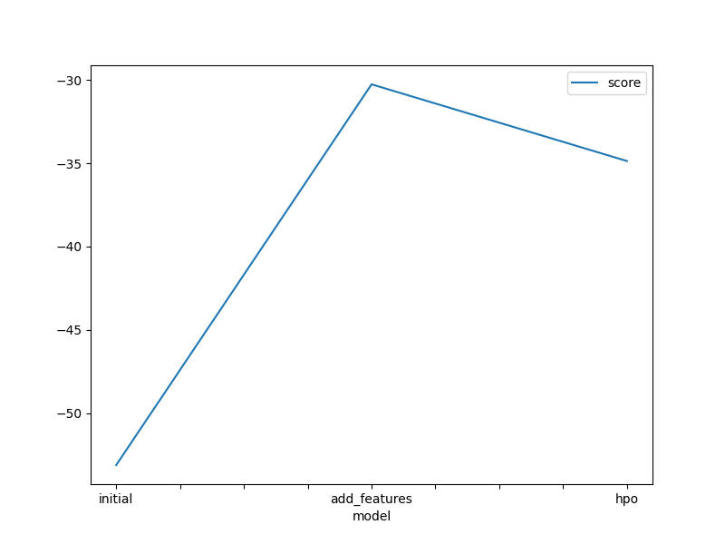
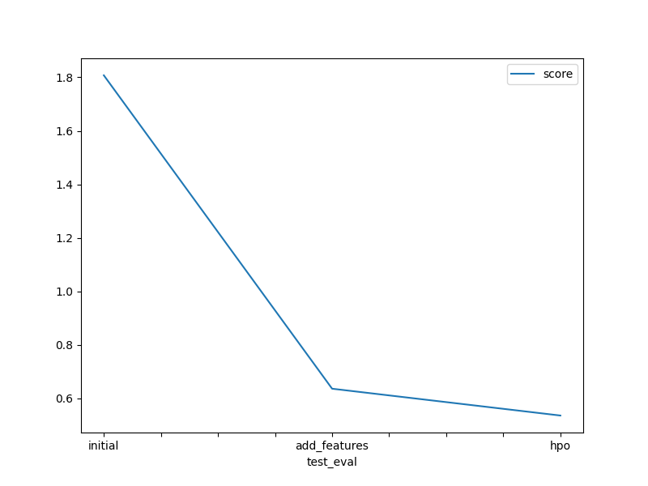

# Report: Predict Bike Sharing Demand with AutoGluon Solution
#### WARDHANI SUKOCO

## Initial Training
### What did you realize when you tried to submit your predictions? What changes were needed to the output of the predictor to submit your results?
In order to execute the model as intended, I had to address syntax errors and carefully examine additional documentation. Initially, I encountered difficulties initiating the tasks on my local environment. Eventually, I made the decision to shift to Google Colab from SageMaker studio. This transition proved beneficial as I achieved enhanced results, with scores consistently below 0.6. This was a marked improvement compared to the initial scores, which consistently exceeded 1.8.

### What was the top ranked model that performed?
My best score is when I change the hyperparameters in third task 

## Exploratory data analysis and feature creation
### What did the exploratory analysis find and how did you add additional features?
Upon analyzing the distributions, I observed that the temperature categories followed a normal distribution. To enhance my model, I decided to split the datetime feature into year, month, day, and hour, which proved to be the most effective. The distribution indicated the presence of all four seasons for the season feature, while the weather feature consisted of three distinct categories. Workday and holiday were binary fields, and I noted that humidity was skewed to the left, whereas windspeed exhibited a right-skewed distribution.

### How much better did your model preform after adding additional features and why do you think that is?
In my opinion, the most significant improvement in the model was achieved by splitting the datetime field into year, month, day, and hour. This change resulted in a substantial enhancement, which I estimate to be around 300%.

## Hyper parameter tuning
### How much better did your model preform after trying different hyper parameters?
The performance of the model significantly improved after hyperparameter tuning, surpassing the results of the initial submission.

### If you were given more time with this dataset, where do you think you would spend more time?
If I had more time to work with this dataset, I would be interested in exploring further possibilities by running AutoGluon for an extended period. This would involve experimenting with different presets and further enhancing hyperparameter tuning to uncover additional potential outcomes.

### Create a table with the models you ran, the hyperparameters modified, and the kaggle score.
|model|score|
|--|--|
initial|1.80734
add_features|0.63660
hpo|0.53636

### Create a line plot showing the top model score for the three (or more) training runs during the project.

### Create a line plot showing the top kaggle score for the three (or more) prediction submissions during the project.

## Summary
Working with the features and conducting exploratory data analysis (EDA) provide the greatest benefits in understanding the data. Moving forward, my objective would be to enhance the model by considering the impact of working hours on bike demand. By utilizing automatic hyperparameter tuning, model selection/ensembling, and architecture search, AutoGluon effectively explores and exploits the best available options.
